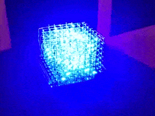

# Cubet (CUBID-19) 
Cubet, a small single color led cube, build during the Covid-19 Quarantine

I always wanted a LED Cube, a compact one with smd leds. I also wanted to give KiCad a try (I've been Eagle user for a couple of years). That's why I started this mini project.

My goal was: 
- Small LED Cube, not bigger than 5cm
- No extra power needed (USB powered)
- Cheap (i.e. Shift Register instead of "expensive" LED Drivers, no SK6812/ws2811 leds)
- Designed with KiCad

I started with the Schematic and Layout in January, and the PCB came together with COVID, so I had plenty of time to solder.
I gave my cube the name of Cubet (catalan word for small cube), but CUBID is also a good name :)

The microcontroller is a SAMD21, with native USB, so no FTDI or similar is needed. It' a simple Arduino Zero compatible board, like the Feather M0 from Adafruit
It uses 74HC595 Shift Registers and a couple of transistors.

My tools are not the best one, and I realized I may need to buy better and new tools. For example my soldering iron is a cheap one and the soldering was quite a challenge (The head was too big for some components, and it didn't get hot enough). 
I also may need a Microscope, it's more pleasant than a magnifying glass. The tweezers were of course also too big. 

For the LED Matrix/Cube I need to develope a helping tool or something similar. My idea was to use 8 big holes in the PCB to put there 8 LEDS and solder them together to get a column. This didn't work as expected so I neede to solder without help.
I used 0.3mm Wire for the columns, and 0.2mm Wire for the rest.

:warning: The README is still in working process

:warning: The Software works, but the animations must be still coded

## Getting Started

* Install KiCad and make changes to the schematic/layout (if needed)
* Get the PCB from your favourite Producer
* Solder all the components
* Flash the Bootloader (if needed)
* Flash the Software

#### Prerequisites

* A lot of time 
* Patience
* More patience
* Soldering skill
* JTAG Programmer (I used an J\-LINK EDU Mini)
* More time
* Did I mention patience?

### Installing 
#### Flashing the Bootloader
#### Flashing the Software

## Built With

* [KiCad](http://www.kicad-pcb.org)
* [PlatformIO](http://platformio.org)

## Authors

## License

This project is licensed under the Apache License - see the [LICENSE.md](LICENSE.md) file for tedtails

## Acknowledgments

[LED-Cube](https://github.com/fuchsalex/LED-Cube)
[Mini KiCad Tutorial] (https://github.com/MalphasWats/hawk)
[KiCad Freerouting](https://github.com/miho/freerouting)
[Gerber Export](https://jnduli.co.ke/prepare-kicad-pcb-elecrow.html)
[PCB from Elecrow](https://www.elecrow.com/pcb-manufacturing.html)
[SAMD21] (http://ww1.microchip.com/downloads/en/DeviceDoc/SAM_D21_DA1_Family_DataSheet_DS40001882F.pdf)
[SAMD21 GDB] (https://learn.adafruit.com/debugging-the-samd21-with-gdb/setup)
[SAMD21 Bootloader Protection] (https://roamingthings.de/posts/use-j-link-to-change-the-boot-loader-protection-of-a-sam-d21)
[Programming a SAMD bootloader using JLink & Linux] (https://hackaday.io/page/5997-programming-a-samd-bootloader-using-jlink-linux)
[SAMD21\_DMA] (https://aykevl.nl/2019/09/samd21-dma)
[Adafruit\_ZeroDMA] (https://github.com/adafruit/Adafruit\_ZeroDMA)

## Future changes

* RGB leds 
* ESP32 for Blueetoth and WLAN
* SPI, I2C and UART connectors for hardware "upgrades"
* Battery connector and battery charging
* Maybe a 12x12x12 and a 16x16x16 version
* SD card for animations without programming
